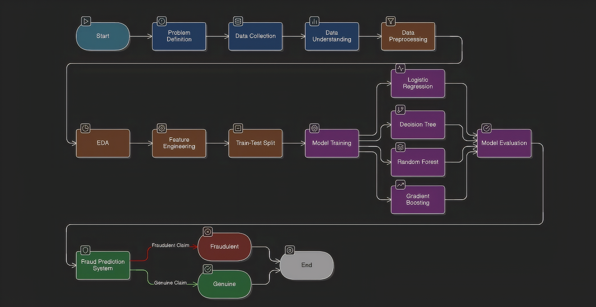

# insurance-fraud-detection-ml
Machine Learning web application to detect fraudulent insurance claims using Decision Tree model and Flask deployment.

---

## 📌 Project Overview

Insurance fraud causes significant financial losses to insurance companies every year.  
This project aims to detect fraudulent insurance claims using machine learning techniques.

The system analyzes multiple claim-related features and predicts whether a claim is **fraudulent** or **genuine** using a trained Decision Tree model.

The application is deployed using **Flask**, allowing users to input claim details through a web interface and receive instant predictions.

---

## 👥 Team Members

1. **Saurabh Dixit**  
2. **Saurabh Keshari**  
3. **Shaad Ali**  
4. **Sharique Ahmed**

---

## ⚙️ Technologies Used

- Python  
- Machine Learning (Scikit-Learn)  
- Decision Tree Classifier  
- Flask (Web Framework)  
- HTML / CSS  
- Git & GitHub  

---

## 🧠 Machine Learning Model

The model used in this project:

**Decision Tree Classifier**

Why Decision Tree?

- Easy to interpret  
- Works well with structured datasets  
- Handles both categorical and numerical features  
- Provides clear decision logic  

The trained model is stored as:

```
dtc_model.pkl
```

A **Standard Scaler** is also used for feature normalization:

```
Std_Scaler.pkl
```

---

## 🔄 Project Workflow

The Insurance Fraud Detection system follows a structured machine learning pipeline.

The process begins with **problem definition**, where the objective is to detect fraudulent insurance claims. The dataset is then collected and analyzed to understand its structure and patterns.

Next, **data preprocessing** is performed to clean the dataset, handle missing values, encode categorical variables, and prepare the data for modeling.

After preprocessing, **Exploratory Data Analysis (EDA)** and **feature engineering** are carried out to identify patterns and improve model performance.

The dataset is then divided into **training and testing sets**.

Multiple machine learning algorithms are trained including:

- Logistic Regression  
- Decision Tree  
- Random Forest  
- Gradient Boosting  

These models are evaluated based on their performance metrics, and the best performing model is selected.

Finally, the trained model is deployed using **Flask**, where users can enter insurance claim details through a web interface and the system predicts whether the claim is **Fraudulent** or **Genuine**.

---

<p align="center">

</p>

<p align="center">
This is the plot representation of the workflow of the Insurance Fraud Detection project.
</p>
